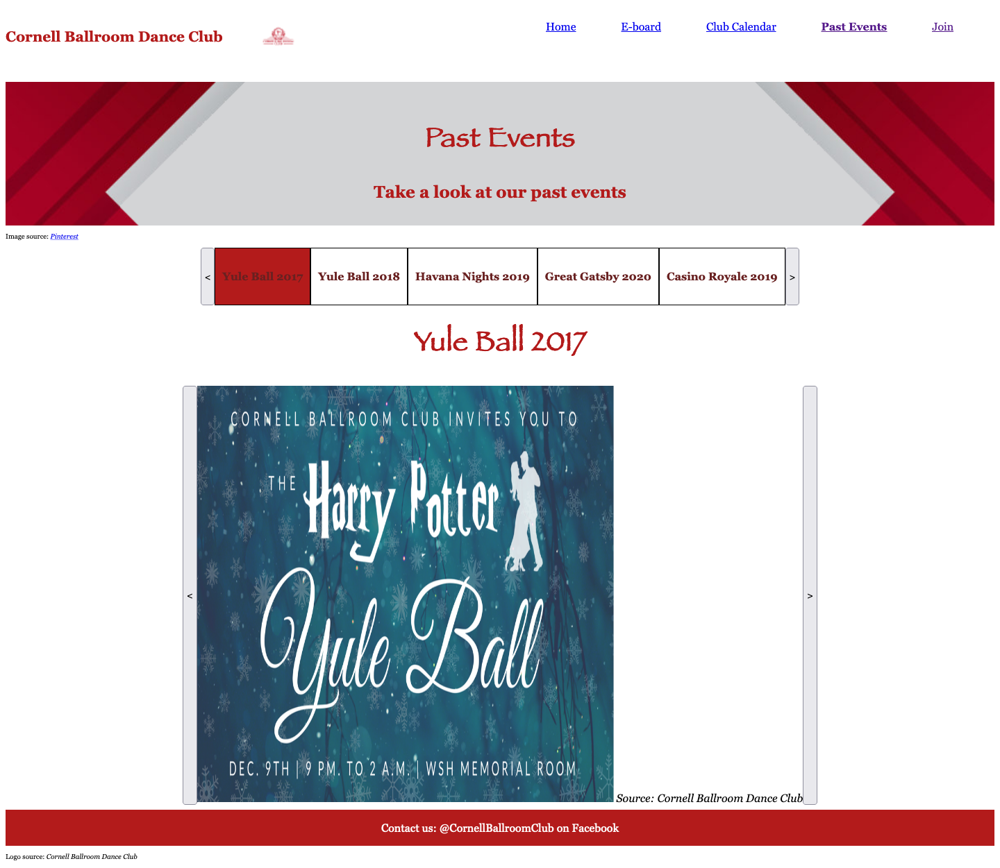
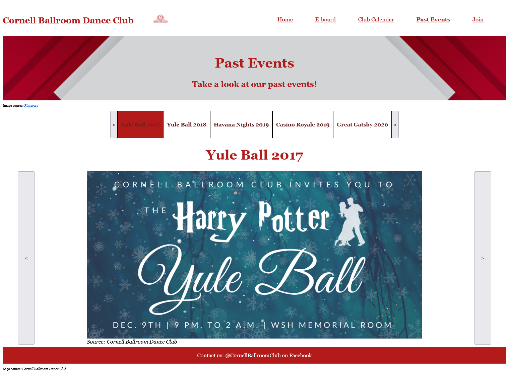

# Group Project: Design Journey

**You are encouraged to work ahead on everything on this project.** (Though we suggest you hold back on the interactivity until Project 3.) **Each section is required for a specific milestone. You are required to have these sections completed before that milestone's deadline.**

**Be clear and concise in your writing.** Bullets points are encouraged.

**Everything, including images, must be visible in Markdown Preview.** If it's not visible in Markdown Preview, then we won't grade it. We won't give you partial credit either. This is your warning.


# Client (Milestone 1)

## Client Questionnaire (Milestone 1)

1. Describe your organization and its purpose.

    - Dedicated to teaching people of all skill levels different types of ballroom dances
    - Teach weekly online lessons over Zoom
    - No commitment, will catch members up if they miss
    - Meant to be more social than the competitive team, designed for the community
    - Host workshops every Tuesday; coached by competitive Cornell ballroom dancers

2. What makes your organization and its services special or unique?

    - Cornell Ballroom Dance Club (CBDC) places a lot of emphasis on the social aspect of the club and ballroom dancing in general, much more so than its sister club, Cornell DanceSport
    - The CBDC is committed to being a resource for learning ballroom for anyone, regardless of experience  level.
    - They want to teach ballroom dancing in a casual, friendly, and fun environment. Practices are in no way mandatory; they are just a place to relax for a bit and dance.
    - Minimal commitment is required for being part of the club. The CBDC wants its members to have a place to have fun while learning new things.
    - The club emphasizes the many social events hosted throughout the year.

4. Who do you want to visit your site? Who is your site's target audience?

    - Students (undergraduate and graduate) who are interested in ballroom dancing
    - People of any skill/experience level

5. When visiting your site, what actions do you want your visitors to take?

    - Join the listserv (send "join" to a specific email address)
    - Be able to find the Club's Facebook page

6. What are your main goals for this site?

    - To have a cohesive source of information for people who are interested in ballroom dancing

7. Is there a "feel" that you want for your site? Are there colors or imagery that you have in mind?

    - Colors include white, red, yellow (and possibly black and gold)
    - Wants a "clean and polished" site, one that is easy to find information
    - Doesn't want site to be intimidating; wants it to have an open, welcoming atmosphere

9. What do you want to be the first thing people see when they click on your site?
    - Short overview (1-2 sentences) about what the club is about
      - Social ballroom dance club of Cornell


10. What are the most important pieces of information you want to emphasize to your audience?
    - Socials and past events
    - Calendar information (weekly lessons and workshops)
    - How to join the club and listserv
    - About the e-board    

11. What content or imagery can you provide for us?
    - Pictures and videos from past social events
    - Previous quarter cards
    - Giving Day video
    - Listserv information
    - E-board members Information
    - Club logo

13. How "big" do you want this site to be?
    - Not too large; just needs to contain the necessary information to see what the club is about and how to join


## Client Description (Milestone 1)
> Tell us about your client. Who is your client?
> Explain why your client meets the client rules in the project requirements.

Our client is the Cornell Ballroom Club (founded in Fall, 1993), and they aim to promote ballroom dancing at Cornell. Their club members consist of students (undergraduate and graduate) and dance instructors.

Our client meets the client rules: we are not our own client, no team member is part of this club, and no team member has a personal relationship with the client.

## Client Website (Milestone 1)
> Tell us about the website that your client wants. Tell us the purpose of the website and what it is all about.
> NOTE: **If you are redesigning an existing website, give us the current URL and some screenshots of the current site.** (FireFox makes it easy to take a full screenshot of a page.) Tell us how you plan to update the site in a significant way that meets the project's requirements.

Our client wants the site to be a cohesive source of information for people interested in the ballroom dancing club (which includes current members as well as interested/potential members). It should emphasize that this is also a social club and is open to people of all ability levels.


## Client Website Scope (Milestone 1)
> Your project should be ambitious, but not too large. A good rule-of-thumb is that you should have about 1 content-full page for each team member.
> Explain why the website you will create for your client isn't too small and isn't too big. Explain why you think it's the right size for this project.

We will create a site that will take into account all of the needs of the client. Specifically, we will have all relevant information on this site, so that the client has an easy way to promote their brand and information about it.

We will have 5 pages on the site: a home page and four content-full pages. This way, we will be able to cover all of our client's goals (have a brief overview of the site, calendar containing weekly classes, information on past and future social events, contact, e-board members, and joining information), but not have too much information on the site such that it is overwhelming to users.


## Client Goals (Milestone 1)
> What kind of website do they want? What are their goals for the site?
> There is no required number of goals. You need as many goals as necessary to reflect your client's desires.

- Goal A: For the website to be a cohesive source of information for people interested in the ballroom dancing club
- Goal B: To make the casual environment of the club clear and to emphasize the social aspect of the club
- Goal C: To have a "welcoming and open" feel
- Goal D: For people to know how to join the club
- Goal E: For club members to be able check the club schedule and find when the lessons and workshops are


## First Client Meeting Minutes/Notes (Milestone 1)
> Include your notes/minutes from the client meeting.

- Client:
  - Masters student here doing material science in engineering
  - Previous president (2019-2020)
  - Currently just helping club get back on feet after Covid
  - During Covid, The club had to switch to remote, which hurt recruitment, workshops, no socials, etc.
  - Hosted classes virtually during Covid, and it was hard to get people involved
  - Lesson manager/secretary for 2018-2019 year
- Cornell Ballroom Dance Club, org dedicated to teaching ballroom dance, a dance that people may not have had access to before and introduce people to it -- getting the club back on their feet after covid
- Competitions outside of Ithaca and have themes incorporated.        
- Cornell would give 5k per social as part of the CU tonight initiative (alternative to parties off-campus). Discounted weekend group lessons. Big graduate student community. Teach tango, ballroom, cha cha, etc. Make a comfortable and casual environment for ppl who want to learn, have fun, and be social. No extra obligations, just dance!
- Have no formal website right now, not really something they were considering because of expertise on the e-board. Even though some members knew website design, didn't feel like making one. But they think a website would be nice to have to share knowledge and get a promo out.
- On the site, they want instructions to join listserv/link to facebook/calendar events/a short background blurb about the club
- Most importantly, this club is committed to being a resource for students to learn ballroom without any prior experience, meet new people, and de-stress!


# Plan/Schedule (Milestone 1)
> Make a plan of when you will complete all parts of this assignment.
> This plan is for your team. There is no required format. Format it so that it works for you!

We will plan to complete all milestones on the Tuesday before the due date, so that we have  a whole day to revise anything together as a group.

We will start Milestone 2 while doing project 3, including the user interviews, content planning, content justification, content organization, navigation, and start exploring layout ideas.

# Site Design/Plan (Milestone 2)

**Make the case for your decisions using concepts from class, as well as other design principles, theories, examples, and cases from outside of class.**

You can use bullet points and lists, or full paragraphs, or a combo, whichever is appropriate. The writing should be solid draft quality but doesn't have to be fancy.

## Understanding Users (Milestone 2)

### Audience (Milestone 2)
> Briefly explain your site's audience. Be specific and justify why this audience is a cohesive group with regard to your client's site. This audience should not be overly broad nor arbitrarily specific. It should be a cohesive group with similar _goals_.

My site's audience is anyone interested in ballroom dancing at Cornell as Cornell Ballroom Dance Club members. The site is especially geared toward those who have little or no experience in ballroom dancing as well as those interested in the social aspect of the club and sport.

My audience represents a cohesive group of people as they all have similar goals; for example, this could be joining the club, learning about the club's social events, of finding the schedule for weekly lessons and workshops.


### User Interview Questions (Milestone 2)
> Plan the user interview which you'll use to identify the goals of your site's audience.

**User Interview Briefing & Consent:** Hi, I am a student at Cornell University. I'm currently taking a class on web design and for a project I am designing a web site for the Cornell Ballroom Dance Club. I'm trying to learn more about the people that might use this site. May I ask you a few questions? It will take about 10-15 minutes. You are free to quit at any time.

1. Have you ever done any kind of dancing before? If so, please tell me about your experience.

2. How did you come to know about Cornell's ballroom club?

3. Are you a member of the Cornell Ballroom Dancing Club?
  - If so, why did you join? What brought you to want to join the ballroom club specifically?
  - How did you find out about the club, what it was about, and how to join?
  - How did you join?
  - Did you seek out information about the club before joining? If so, what information was that?
  - Is there anything you wish you had known before joining?

  - Recall an experience you had as part of the club that you enjoyed.

  - Was there any helpful or relevant information regarding the club put out to you before you wanted to join?  

  - What events or classes have you participated in as part of the club?

4. (For non-members) Are you planning to join the club?
  - If so, how are you planning on doing that?

5. (For non-members) Are you part of any clubs?
  - If so, how did you find out about that club?

  - What information did you know about the club before joining?

  - What information did you seek about about the club before joining?

  - How did you join?

  - Is there any information you wish you had known before joining that you were not able to get?

**After the interview:** This was really helpful. Thank you so much for agreeing to speak with me today. Have a great day!


### Interview Notes (Milestone 2)
> Interview at least 4 people from your audience. Take notes and include those notes here. Make sure to include a brief description of each interviewee.

**Interviewee 1:**

**Description**:
- freshman student at Cornell majoring in mechanical engineering
- has previous dance experience
- from Westchester, New York

**Notes**:
1. Have you ever done any kind of dancing before? If so, please tell me about your experience.
  - Yes; has been doing K-pop dancing since elementary school
  - After starting high school, she joined the hip hop dance club for 2 years
    - Also joined all genre dance club (mostly did modern, cultural dances)
  - After starting college this semester, joined the K-pop dance club (E.Motion)
2. How did you come to know about Cornell's ballroom club?
  - Found their Facebook page after searching for Cornell dance clubs
3. Are you a member of the Cornell Ballroom Dancing Club?
  - No
4. (For non-members) Are you planning to join the club?
  - Yes, but not sure when yet
  - If so, how are you planning on doing that?
    - Will try to see if she can join Spring semester or the following year
5. (For non-members) Are you part of any clubs?
  - Yes, Cornell's E.Motion club
  - If so, how did you find out about that club?
    - After getting into Cornell, she googled "Cornell K-pop dance club"
    - She found E.Motion, then went on Youtube and searched "Cornell E.Motion". She watched their performances and covers
    - She then searched up and found E.Motion's instagram account and Facebook page
  - What information did you know about the club before joining?
    - It's a K-pop dance club
    - They perform throughout the year
  - What information did you seek about about the club before joining?
    - Wanted to see what they were like; searched up videos of the club and watched cover videos and performances
  - How did you join?
    - Went to club-fest and found out about the interest meeting
    - Went to the interest meeting and found how to join the club and the different workshops and practices
    - Learned that they send weekly emails about social events and workshops
  - Is there any information you wish you had known before joining that you were not able to get?
    - No


**Interviewee 2:**

**Description**:
- sophomore student at Cornell majoring in Applied Economics and Management
- no previous dance experience
- from Los Angeles, California

**Notes**:
1. Have you ever done any kind of dancing before? If so, please tell me about your experience.
  - No previous dance experience
2. How did you come to know about Cornell's ballroom club?
  - Found out about it through some friends and decided to go to the info session with them
3. Are you a member of the Cornell Ballroom Dancing Club?
  - Yes; I joined because it was a very inviting community and good way to make friends while trying something new. I 'auditioned' and made the team. I did not really seek out any additional information before joining and there was nothing in particular that I wish I had known before joining. My favorite memory was having a team dinner with all the members.
  - Was there any helpful or relevant information regarding the club put out to you before you wanted to join?
  - There was not much relevant info besides important dates to know.
  - What events or classes have you participated in as part of the club?
  - Because I am a sophomore and with covid happening last year, there is not much we have done yet, but we are planning to perform at upcoming Cornell events so look out for that.


**Interviewee 3:**

**Description**
- Sophomore student at Cornell majoring in Biology
- previous ballroom dance experience
- from Washington DC

**Notes**
1. Have you ever done any kind of dancing before? If so, please tell me about your experience.
  - Ballroom for 5 years.
  - Enjoyed it, was junior assembly leader for last 2 years.
2. How did you come to know about Cornell's ballroom club?
  - Yes. Looked it up on course options
3. Are you a member of the Cornell Ballroom Dancing Club?
  - No.
  (Asked followup) Why aren't you a member?
  - Limited options for taking class, timing didn't work out
4. (For non-members) Are you planning to join the club?
  - No.
5. (For non-members) Are you part of any clubs?
  - Yes. Marginalia- Poetry club.
  - Found out about it at club fair.
  - What information did you know about the club before joining?
    - Nothing.
  - What information did you seek about about the club before joining?
    - Nothing.
  - How did you join?
    - Showed up to first meeting.
  - Is there any information you wish you had known before joining that you were not able to get?
    - No.

**Interviewee 4:**

**Description**
- Sophomore student at Cornell majoring in Industrial Labor Relations
- Previous dancing experience
- Previous interest in ballroom dancing but hasn't tried it yet
- From Seoul, South Korea

**Notes**
1. Have you ever done any kind of dancing before? If so, please tell me about your experience.
    Yes, Scottish dancing in high school.
2. How did you come to know about Cornell's ballroom club?
    Was told about an event by a friend.
3. Are you a member of the Cornell Ballroom Dancing Club?
    Not yet, but is interested.

4. (For non-members) Are you planning to join the club?
    Yes, but need information on how to join.
  - If so, how are you planning on doing that?
    Is unsure of recruiting process.

5. (For non-members) Are you part of any clubs?
  - If so, how did you find out about that club?
    Cayuga Capital, Cornell club fair

  - What information did you know about the club before joining?
    Learned about structure and what they do and members

  - What information did you seek about the club before joining?
    Culture and activities, alumni network

  - How did you join?
    Talking with current members and three rounds of interviews

  - Is there any information you wish you had known before joining that you were not able to get?
    No

### Goals (Milestone 2)
> Analyze your audience's goals from your notes above. List each goal below. There is no specific number of goals required for this, but you need enough to do the job (Hint: It's more than 1 and probably more than 2).

Goal 1: find out how to join the club
- **Design Ideas and Choices** _How will you meet those goals in your design?_
  - I will design a page that users can use to join the listserv and find out about information sessions for anyone wanting to join the club.
  - This page will emphasize that no previous experience is necessary to join the club and highlight the casual and social/fun aspect of the club.
- **Rationale & Additional Notes** _Justify your decisions; additional notes._
  - Since this is a primary goal for many of our users visiting the site, it is important to dedicate an entire page to explaining how to join the club.
  - Since users who are potentially joining the club will visit this page, it is important that it is inviting and welcoming.

Goal 2: find dates (and locations) of upcoming events and workshops
- **Design Ideas and Choices** _How will you meet those goals in your design?_
  - I will dedicate a section to socials/calendar information that includes weekly lessons and workshops.
  - This will include the dates of all upcoming events that club members need to know about.
- **Rationale & Additional Notes** _Justify your decisions; additional notes._
  - As seen by the user interviews, club members are interested in important dates, such as for events and weekly workshops.
  - Additionally, as seen by the user interviews, non-members are interested in knowing the dates and timing of various events, in order to see if these events will fit within their schedules.
  - new members to clubs also want to know when the first meeting for a club will be, as this is a key factor for being able to join the club.
  - Since the socials are a large aspect of this club, they will also be included on this page.
  - Club members, a large part of our audience, will be checking this site for when to attend the dance workshops. Due to the effect of Covid-19, currently, the weekly online lessons are hosted on Zoom, while workshops are in Willard Straight Hall.
  - This page will be a cohesive source of information for club members looking for club event information.

Goal 3: see previous dance performances and events
- **Design Ideas and Choices** _How will you meet those goals in your design?_
  - I will include pictures, videos, and descriptions of past socials and events.  
- **Rationale & Additional Notes** _Justify your decisions; additional notes._
  - As shown by the user interview, prior to joining, students want to know what the club's current performances and dances are like.
  - This page will entice users to join the club by accentuating the fun and beginner-friendly atmosphere. It will also provide an idea of what the club is all about and the fun events that are available.

Goal 4: contact information for club
- **Design Ideas and Choices** _How will you meet those goals in your design?_
  - I will dedicate clear contact buttons on each page.
  - There may be a contact page or possibly contacts for the current e-board.
- **Rationale & Additional Notes** _Justify your decisions; additional notes._
  - My interviewee talked about how they contacted and met with members before joining their business club.
  - If the website doesn't provide all the information a new members might need than they can contact the club itself.
  - An ancillary benefit would be satisfying any reasons someone not looking to join may have for visiting the website, because these often include looking to the contact the club.

## Content Planning (Milestone 2)

**Plan your site's content.**

### Your Site's Planned Content (Milestone 2)
> List the content you plan to include your personal website. This should be a comprehensive list.

- How to join the listserv and club.
- Brief description about the club
- Upcoming and past socials
- Weekly lessons and workshops
- Meet the e-board
- Pictures of past events, classes, and practices
- Contact information
- Social media


### Content Justification (Milestone 2)
> Explain (about a paragraph) why this content is the right content for your site's audience and how its addressed their goals.

- Given that our audience includes people interested in ballroom dance and looking to join the club, it is highly appropriate to dedicate part of our website on informing users how to join the listserv. This way, users can receive more information on the club and decide whether or not they want to join. Through emails sent from the club, users can find out about upcoming information sessions, interest meetings, and information on joining the club.
- We will also include how to join the club on our site. This is right for our site's audience because many of our users visit the site to learn how to join the club and if there are any requirements or pre-requisites to do so. We will emphasize that there are minimal requirements to joining the club and make it clear to them that anyone, regardless of dance level or past experience — is welcome our club.
- One of our audience's goals is to know what is upcoming in the club. As such, we'd need to include upcoming socials in order to satisfy this and help them find this information. In addition to wanting to learn more about upcoming events, we also saw our audience wanted to find out about past socials. So, by including information on these past socials, we can give our audience a sense of what the club has done in the past and convince them to join.
- As per our audience goals, we want to include information on the weekly lessons and workshops so they can not only find out how they can join and participate in the club, but know when the events are so they can fit them into their schedules.
- In terms of our audience goals, we want to have a meet the e-board page to allow viewers to understand who their point of contact will be and who they can get more information from if they are interested in the club. This addresses the goals by allowing the audience to understand more about the people of this club.
- Pictures of past events, classes, and practices is key to have in the site because it gives insight on how this club has been in the past and what potential members could expect if they were thinking about joining.
- Contact information is necessary given that our audience may have additional questions about the club. Having contact information also helps any other audiences that may be visiting the website, because they are likely going to need different information than the audience the site is intended for.
- New members may be interested in social media to see additional photos and past club events. New members may follow the social media and then be reminded to join when they see new posts.

## Information Architecture (Milestone 2)

### Content Organization (Milestone 2)
> Document your iterations of card sorting here.
> Include photographic evidence of each iteration of card sorting and description of your thought process for each iteration.


**Iteration 1:** For this iteration, I decided to group all of the joining information together (i.e. how to join the club and how to join the listserv). This group would be for people who are not part of the club yet, but are interested in joining. The next group consists of all the information about social events. Since this club emphasizes its social aspect, I thought it would be appropriate to dedicate a page to the upcoming and past socials as well as the pictures of all the events. The third group consists of the weekly lessons and workshops. This group is intended to be used by current members interested in upcoming lessons and workshops. The fourth group is about the current members and club information; thus, it includes the e-board members, club contact information, and club social media. Lastly, the fifth group consists of general information about the club that both new and current members are interested in: brief description and how to join the listserv.


**Iteration 2:**
For this iteration, we have decided to group together the join club contents and the listserv because they go hand in hand and encompass the steps of joining. Then we grouped together upcoming and past socials. This section is pretty self explanatory and encompasses socials so that the audience can see what an aspect of being apart of this club is like. Next, we have grouped weekly lessons and workshops because they are similar in that they give insight to when lessens and workshops are and what they entail. The next page will be meet the e-board. We decided to have a separate page for this because it gives a clean and concise area for the audience to see who they can get into contact with without getting confused or overwhelmed with other content. Lastly, we decided to have contact info, social media, club description, and pictures as the home page because it is the most essential information that introduces the club and what it is about.


**Iteration 3:**
For this iteration, we decided to have a large homepage so that user's do not need to navigate to other pages for any of the basic information about the club. This homepage includes, the join information for the club and listserv, a description for the club, and contact info. The homepage will also include pictures of past events and classes and have links to the social media with more photos. Three other small pages exist. One which mainly includes a list or calendar of upcoming lessons and workshops. Another for upcoming socials that also showcases past socials. And a final page which has the e-board information. This iteration is good for people new to the club because most of the basic information they would need is on the homepage. However, this does mean that there are not pages dedicated for each of their needs and may be a lot of information on a homepage.


**Iteration 4:**
With this iteration, we changed it from the previous one by separating the pictures onto its own page. Although we still want to have pictures on each page, we felt that it would be nice to have a dedicated page to just have a gallery of their past events, so our audience would have plenty of content to scroll through (potentially in a carousel) while also giving it its own place to stand out.

       
**Iteration 5:**
For this iteration, I decided to group together pictures of past (social) events with their corresponding descriptions. Then, I grouped together the content about future events, i.e., upcoming socials and weekly lessons/workshops. This group is intended for current members of the club; this way, they will have a cohesive page to reference regarding upcoming events. The next group is for non-club members who are potentially interested in joining the club. Thus it contains instructions on how to join the club as well as the listserv. Next, I have a group dedicated to members of the e-board. This piece of content is in its own group as the information did not fit with any of the other groups' content (since it is about individual members of the club). This group is important to include as new/potential members want to see who some of the current club members are. They may also want to reach out to the e-board with individual questions or see what each member is responsible for. Lastly, I grouped together general club content that gives users a very brief overview of what the club is. This group consists of a club description, pictures of events, and the club's social media.


### Final Content Organization (Milestone 2)
> Which iteration of card sorting will you use for your website?

Iteration 5

> Explain how the final organization of content is appropriate for your site's audiences and their goals.

Each group is organized in a way that is intuitive for our audience and fits their goals. For example, there is a group that is mainly dedicated to current club members. This group is a calendar of for upcoming events (e.g. socials, workshops, lessons). Anyone who wants to see upcoming events can check this page for a cohesive source of information.

The next group consists of information for non-club members or potential club members. On this page, they will be able to find how to join the listserv to be able to receive emails about club information (e.g. interest meetings) and what they need to do to join the club.

Next, I put information on e-board members in its own group as this content is about individual members of the club rather than the club itself.

The group with the past social events (information and pictures) fits our audience goals found through the user interviews. Our interviewees said that before joining a club, they like to see what the club has done in the past as well as the club culture. Thus, this page will give potential members insight to what the club is like. Unlike other the calendar, this group contains information on the club's past events (as opposed to future ones)

The final group consists of general information of the club that will give users a brief overview of what the club is. This group consists of a club description, pictures, and the club's social media information.

The club's contact information will be on every page for the users to have easy access to. This way, they will not have to switch pages if they are scanning one of the pages and have a question or concern they want to contact the club about.


### Navigation (Milestone 2)
> Please list the pages you will include in your personal website navigation.

- Home
- E-board
- Club Calendar
- Past Events
- Join

> Explain why the names of these pages make sense for your site's audience and their goals.

"Home" makes sense for my audience because it contains general information about the club (e.g. what it is) that users should know before navigating onto other pages. Its content is what users expect to find on a site's home page: a brief overview of the club, pictures, and the club's social media and contact information. This page has information relevant to both club members and potential members; thus, the name "Home" makes sense for my audience.

The name "E-board" makes sense to for audience because it describes exactly what users can expect to find on this page. Rather than making it "Meet the E-board", I decided on "E-board" because I felt that the former choice was too long and thus didn't match the lengths of the other page names.

"Club Calendar" makes sense for our audience because it indicates that upcoming events and workshops will all be shown on this page. The name also indicates that it is mainly used by current club members. However, potential club members can also click on this page and see if they are interested in any upcoming events.

"Past Events" fits our user goals that were found through the interviews. Before joining a club, students indicated that they like to see the club culture and what the club has done in the past. Thus, any user wanting to do that will know that they can click on this page to find out about the fun events the club has hosted in the past.

Lastly, "Join" makes sense for our audience because it makes it clear that this page is for potential members of the club. "Join" indicates that they will find information on both joining the listserv and joining the club on this page.


## Design (Milestone 2)

### Visual Theme (Milestone 2)
> Discuss several (more than two) ideas about styling your site's theme. Explain why the theme ideas are appropriate for your target audiences.
> Note the theme you selected for you site and why it's appropriate for the audience and their goals.

- **Theme 1**: welcoming theme and exciting theme
  - This club is a beginner friendly club and emphasizes its social aspect. It wants to ensure potential members that no prior experience is required to join and that everyone is welcome.his theme also matches the low commitment level required in this club as anyone can join, no matter how many events they will or will not be able to attend. As our audience consists of club members and potential club members interested in ballrom dance, we also want to them to be excited about this club and its events. By making our theme exciting as well as welcoming, we highlight the fun aspects of the club (we will do this by our use of red and yellow on the site as well as including the past events page).
  - Firstly, one of the color schemes that came up in discussion for this is a combination of white, red, and yellow. As one of their logos they provided for us was red, it would make sense to include that color and others that would compliment it well. For this color scheme, it would probably make sense to either have a white or yellow background, as red is not very readable. However, I feel that yellow is also challenging to work with, as it is difficult to read, which goes against the goal for the target audience of making sure information is easily accessible. So, a potential theme would be having a white background, and having font that is either of red or a dark yellow (close to gold). These would not only compliment each other, but also make the site feel welcoming, as it won't strain the eyes of our audience as they search for their information. We could also use the red to highlight important content on the site, as it would stand out from the background.

- **Theme 2**: Professional theme
  - Since we want our site to appear reliable, our next idea is a professional themed site. This way, any potential club members will be confident that the information they find on here is reliable.
  - With this theme, the text will be as easy to read as possible. I will use standard font families, black text, and make sure that there is ample space between lines. The images will have sharp edges like those on a professional site. There will be no distracting colors, fonts, or images. The colors used will be muted and will all complement each other to match the professional theme of the site

- **Theme 3**: Beginner friendly theme
  - Since a large part of our audience includes people with little to no ballroom dance experience, having a beginner friendly theme will make them less intimidated and perhaps more eager to join.
  - As part of this theme, in contrast to the second theme, the image will all have rounded edges; the text-font will be rounded and there will mainly be muted colors as to not overwhelm our audience.

- **Final theme:** Theme 1
  - When talking with the client, we discussed what "feel" they wanted for their site. They said they wanted it to be non-intimidating, and have an open, welcoming atmosphere. As such, it's important for us to choose colors and design patterns that reflect this. Our strategic use of white space will make the site non-intimidating and our use of red and yellow will make the site appear as enticing and exciting as possible.
  - The font used will also reflect this theme.

### Interactivity Ideas (Milestone 2)
> Brainstorm several ideas for your site's interactivity.
> Provide a very brief summary how each idea improves the usability of the site for the site's audience.

- Interactive Calendar: As we already are planning on adding a calendar to the website, it could make sense to make it interactive, in order to make it easier for our audience to find the dates and information they're looking for. Users will be able to click on the left and right arrows near the calendar to find information for different months of the year

- Carousel: As there will be many pictures on our site as part of our welcoming and beginner-friendly theme, we do not want to overwhelm users by listing many pictures on a page either vertically or horizontally. By implementing carousels, we allow the user to be able to concentrate on one picture at a time. Furthermore, this will make it so that each image can be made larger and easier for users to view.


### Layout Exploration (Milestone 2)
> Iterate on your site's design through sketching.
> Sketch both the mobile and desktop versions of the site.
> Here you are just exploring your layout ideas. You don't need to sketch every page.
> Provide an explanation for each sketch explaining the idea and the design patterns you are leveraging.

**E-board (mobile)**

- Here, I leveraged familiar design patterns to improve user experience. The organization name and logo is at the very top of the page, and the navigation bar is right under it. The title of the page is at the top as well, and right underneath the content is listed vertically. The content here is stacked on top of each other rather than side by side to prevent users from having to scroll horizontally. To make the most of the white space net to each list, I included corresponding pictures next to each e-board member.
- The heading of this page is  identical to the other ones so that users will not be confused when switching from one page to another.
- On this mobile design, the navigation bar takes up the whole length of the page. This is so that users will be able to click on each page in the navigation bar without difficulty.
- Text size will also be increased here so that users can read the content on smaller screen sizes.

**E-board (desktop)**

- For the final sketch of this page, like in previously mentioned pages, I implemented common design patterns: a top navigation bar; an organization name and logo listed on the top of the page; and contact information on the bottom of the page.
- Beneath the title of the page, the names of the e-board members are listed side by side to take advantage of the available space on the screen. The two sections take up equal amount of space as they have the same importance.

**Home (desktop)**

- For the home page, this iteration shows the club description, images, and social media handles. I have the nav bar going horizontally on its own line. Then I have the club description along with a corresponding image along side it. Then, I have placed a couple more images under that. Lastly, I have the social media beneath that. This is concise and allows the audience to follow through as they scroll down.

**Home (desktop)**

- For this iteration of the home, I took into consideration the site as a whole. Having a concise site is very important, so I have the nav bar sharing a line with the heading/title so that it matches all of the other pages in the site. Then, I have the club description on its own line. Then, all of the images are underneath just so that everything is consistent and the site looks more polished. Lastly, the social media will be under the images.

**Home (desktop)**

- This iteration is like the one above, just with the addition of some borders and visual aesthetics that make the page more formal.

**Home (mobile)**

- For the mobile version of the home page, the format is relatively the same, just represented in a more vertical manner. The nav bar is now on its own line for spacial reasons and also to match the rest of the pages' mobile layout. The images are now smaller but still aligned together.

**Join (desktop)**

- For the desktop layout of the join page, we have the club name and logo and the nav bar on one like at the top. Then we have the join heading. Beneath that, we have the instruction on how to join the club on top of how to join the listserv. This is a horizontal layout and most elements that go together are inline.

**Join (desktop)**

- This iteration is like the one above, just with the addition of some borders and listed items that make the page more formal and readable.

**Join (mobile)**

- For the mobile layout of the join page, content is structured very similarly as the desktop layout just because the nature of the content is very simple. However, in this version, content is displayed in a more vertical manner. The title remains at the top and the nav bar is on its own line to match the rest of the pages. The how to join statements are on a separate line and then the instructions are on their own lines. This is true for both the joining of the club and the listserv.

**Join (mobile)**

- This iteration is like the one above, just with the addition of some borders and listed items that make the page more formal and readable.

**Calendar (mobile)**

- For the mobile layout of the calendar page, the content is structured as it will be for the desktop, except that the nav will have its own line. I chose to keep the calendar how it is because most calendars on mobile devices are still structured as the full calendar and if I were to split the weeks in another way, it would end up being confusing or inefficient to the user.

**Calendar (desktop)**

- For the desktop layout of the calendar page, the content is structured as it was for the mobile, except that the nav and logo are on the same line. The only difference with the calendar is that there is that the days are more spread out.

**Past Events**

- My desktop site is mostly similar to the mobile version, except I tried to utilize all the horizontal space that I could. I switched the indicator for my carousel to the left side, as it will then allow me to have more space for my pictures/content within the middle. As this is the centerpiece of the site, I want it to occupy as much as is possible.


- On this page, I aimed for a design similar to that of the e-board page, by producing a familiar design for the user that will help make them more comfortable using the site. Where I varied, however, was in my usage of vertical space. I wanted to try and fit as much in as I could, so I designed it so my picture will adjust to the full width of the page while the buttons and navigational elements fill the vertical space. I still, however, made sure to have my navigation buttons left to right, as it would make the most sense for navigating my pages within the carousels.


### Final Interactivity Design (Milestone 2)
> Explain and/or provide annotated sketches of the interactivity you will implement for your site.
> Explain how the interactivity improves the usability of the site and helps the site's audiences meet their goals.

**E-board mobile interactivity**

- As seen above, whichever image is currently being viewed will be displayed the big box in the carousel. In addition, the corresponding slide dot will be filled in. In the example in the sketch, the user is currently viewing the second image; thus, beneath the image, the second dot is filled in.
- When the user hovers over any of the dots, that dot will darken to indicate that it is clickable.
- The cursor will change to a hand (pointer) cursor when hovering over a button that the user can click on.
- The user can click on any of the six dots to instantly navigate to that image.
- The image source will be written on the image.
- Users will no longer have to read a board member's description and then scroll up/down the page so much to view a desired picture. Instead, they can just click through the carousel which allows for a more pleasing and easier experience.
- Since my users read from left to right, their eyes will now travel smoothly from from the left side of the page (containing the description of the e-board member) directly to the right side of the page where they can look at any of the images.
- Furthermore, this way, the user will be able to concentrate on one select picture at a time instead of potentially being overwhelmed by all of the pictures on the page.
- This will also make it so that each image can be made larger and easier for the users to view.
- Since we want this site to be as welcoming as possible and not overwhelm users, having a carousel on this page would help accomplish this goal.

**E-board desktop interactivity**

- The desktop version of the page will have the same interactivity features as the mobile one.

**Calendar interactivity**

- The calendar will act as a carousel, with users being able to click the buttons to move from one month to the next, allowing users to see upcoming events and workshops in a calendar form.
- The buttons will darken when users hover over, showing users they are clickable.
- The current day will have a different color than the rest of the calendar to quickly show the user what day it is without them having to find it themselves.
- The days will also change background color when hovered over with mouse to show they may be clicked.
- Days with event's can be clicked for a drop down menu which shows users more information.

**Past events interactivity**
- For the past events page, I will be implementing carousels within a carousel. This might seem like a mouthful, but it is designed to fit as much relevant content as possible on this page without overwhelming the audience. The client wished for us to include all of their past events on our website, and given that there were 5 main events, we needed a way to split them up but show pictures from each. Rather than just having 5 carousels on the page at all times, we determined that having one carousel that contained each event in its own carousel would be the most efficient space-wise.
- This interactivity works by the user clicking a button to cycle through an indicator of 5 different events. Once they find the event they like, the carousel for that event will be visible, and they can then cycle through photos of that event by clicking on that carousel's buttons.


### Final Design (Milestone 2)
> Include the final sketches for **each** of your site's pages.
> The sketches must include enough detail that another 1300 student could implement them.
> Provide a explanation for each sketch.

**Mobile Design:**

**Past Events**

- After considering my other design, I decided it would be best for it to follow more closely the calendar page, as they will have some of the same interactivity.
- I had my navigation on the top but below the club title and logo, in order to maximize vertical space and to make it less cluttered given the smaller size. Other than that, it is very much the same as my desktop page, except that the row of indicators and the carousels fill up the entirety of the available horizontal space, as well as the buttons for the image carousel having no space between them and the images. This allows me to continue to have the images as large as possible to be fairly readible, while not sacrificing functionality.
- The last change I made from my previous design was to have the buttons be attached to the indicator row instead of being below it. I felt that this was a waste of space, and by attaching it to the row, it allowed me to utilize more of that space for my carousels.

**E-board**

- I used familiar design patterns to design the page's header and presented the content in a very intuitive manner.  
- I put the organization name along with the navigation bar at the very top of the page as the header. As soon as users access the website, they will know what kind of information they can find on it (as well as where to go if they have questions). Also, the navigation is arranged in such a way that it is easy for users to click on each item as each element's text is large and spaced out. The navigation bar's elements will take up the entire width of the page so that users will have an easy time clicking one each item with their finger.
- I put the organization name at the top of the page, and the title of the page right underneath. This way, users will know exactly what they will find on the page they are currently viewing.
- As seen below, the other pages' headers are exactly the same (except with a different page title) and the contact information is also at the bottom of the page. This helps maintain consistency on our site and provides a more welcoming user experirence.
- For the interactivity, whichever image is currently being viewed will be displayed the big box in the carousel. In addition, the corresponding slide dot will be filled in. In the example in the sketch, the user is currently viewing the second image; thus, beneath the image, the second dot is filled in.
- The user can click on any of the six dots to instantly navigate to that image.

**Home**

- For the mobile version of the home page, the format is relatively the same as the desktop, just represented in a more vertical manner. The nav bar is now on its own line for spacial reasons and also to match the rest of the pages' mobile layout. The images are now smaller but still aligned together. The content goes chronoligically down so that the audience can easily follow with scrolling, zooming in , etc.

**Join (before re-design from user testing)**

- For the mobile layout of the join page, content is structured very similarly as the desktop layout just because the nature of the content is very simple. The title remains at the top and the nav bar is on its own line to match the rest of the pages. The how to join statements are on a seperate line and then the instructions are on their own lines. This is true for both the joining of the club and the listserv.

**Join (after re-design from user testing)**

- The only difference here is that after user testing was conducted, we changed the join listserv content to be on top of the join club content because the user pointed out that it makes more sense to have information on how to join the listserv to get information about the club before joining the club.

**Calendar**

- There is a logo at the top with a navigation bar beneath. The calendar has a header, showing users they are on the right page. Then the interactive calendar is below.

**Desktop Design:**

**Past Events**

- My desktop design almost exactly mirrors my mobile design, although with a few changes. Given the extra horizontal space, I wanted to follow good design patterns and fill it up as much as possible. To do this, I had the navigation bar sit at the top of the page with the club name and logo, allowing me to make my carousels for the images bigger. This makes them more readable on the larger screen, and overall improves user experience. Additionally, I chose to cap my indicator bar from expanding further and have it centered on the page, as I felt when it got too large, it wouldn't help increase functionality and instead would become harder to read and interpret.
- As another note, I changed from my previous design by having the buttons continue to be horizontal instead of vertical, as I determined that change would only serve to confuse the audience and wouldn't actually recover any more space as it was intended to do.

**E-board**

- For the final sketch of this page, like in previously mentioned pages, I implemented common design patterns: a top navigation bar; an organization name and logo listed on the top of the page; and contact information on the bottom of the page.
- In this design, the navigation bar shares a line with the organization name and logo. It utilizes the entire horizontal space that is available.
- Beneath the title of the page, the names of the e-board members are listed side by side to take advantage of the available space on the screen. The two sections take up equal amount of space as they have the same importance.
- The interactivity on the desktop design will be exactly the same as in the mobile design so that users will not be confused when accessing the page from another device.

**Home**

- We have the nav bar sharing a line with the organization name and logo so that it matches all of the other pages in the site. Then, I have the club description on its own line. Then, all of the images are underneath just so that everything is consistent and the site looks more polished. Lastly, the social media will be under the images.

**Join (before re-design from user testing)**

- For the desktop layout of the join page, we have the club name, logo, the nav bar on one like at the top. Then we have the join heading. Beneath that, we have the instruction on how to join the club above the how to join the listserv. This is a horizontal layout and most elements that go together are inline block elements.

**Join (after re-design from user testing)**

-Similarly as before, the only difference here is that after user testing was conducted, we changed the join listserv content to be on top of the join club content because the user pointed out that it makes more sense to have information on how to join the listserv to get information about the club before joining the club.

**Calendar**

- There is a logo and navigation bar in the header. The calendar has a header, showing users they are on the right page. The interactive calendar is below the header.


### Design Rationale (Milestone 2)
> Explain why your design is appropriate for your audience. Specially, why does your content organization, navigation, and site design/layout meet the goals of your users? How did you employ design patterns to improve the familiarity of the site for your audience?

These design choices are appropriate for our audience because we have efficiently grouped and displayed content in a way that gets all of the important information to the audience in an easy to understand and effective manner. Everything is easy to follow and accessible for the viewer. Ultimately, the users goals encompass wanting to learn more about this club and what it entails, which is done through specific groupings of content placed into pages in an organized manner that users can navigate to any page they want for specific information made clear by the navigation/page names. We are using design patterns such as carousels and other layouts that are commonly used by thousands of other websites and are familiar to web users.


## Interactivity Plan (Milestone 2)
> Now that you've designed your interactivity for your site, you need to plan how you will implement it.
> Describe how you will implement the interactivity. This should be a complete plan that another 1300 student could use to implement the interactivity.
> You should list the elements, any CSS classes, events, pseudocode, and the initial state.


```HTML interactivity plan for past-events.html:
buttons:
  <button type="button" id="havana-button-left">&#60;</button>
  <button type="button" id="havana-button-right">&#62;</button>

carousels:
<div id="havana-carousel" class="hidden">
  <h1>Havana Nights 2019</h1>
  <div class="caro-row">
    <button type="button" id="havana-button-left">&#60;</button>
    <div id="havana-img1" class="selected">
      <h5>placeholder for img1</h5>
    </div>
    <div id="havana-img2" class="hidden">
      <h5>placeholder for img2</h5>
    </div>
    <div id="havana-img3" class="hidden">
      <h5>placeholder for img3</h5>
    </div>
    <div id="havana-img4" class="hidden">
      <h5>placeholder for img4</h5>
    </div>
    <div id="havana-img5" class="hidden">
      <h5>placeholder for img5</h5>
    </div>
    <button type="button" id="havana-button-right">&#62;</button>
  </div>
</div>

Indicators:
<div class="indicator red" id="yule1-indicator">
  <h4>Yule Ball 2017</h4>
</div>
<div class="indicator white" id="yule2-indicator">
  <h4>Yule Ball 2018</h4>
</div>
<div class="indicator white" id="havana-indicator">
  <h4>Havana Nights 2019</h4>
</div>
<div class="indicator white" id="gatsby-indicator">
  <h4>Great Gatsby 2020</h4>
</div>
<div class="indicator white" id="casino-indicator">
  <h4>Casino Royale 2019</h4>
</div>
```
```
CSS Interactivity plan for past-events.html:
  red: turns the indicator red to show which carousel is currently selected
  white: turns the indicator white to show a carousel is no longer selected
  hidden: Hides content
  selected: Shows which image is currently selected and visible in each carousel
```
```
Interactivity Psuedocode for past-events.html:
  when left button is clicked on:
    if current carousel indicator is red:
      remove the red class from that Indicator
      add the white class to that indicator
      remove the white class from the prior indicator
      add the red class to the prior indicator
      add hidden to the current carousel
      remove hidden from the prior carousel
Interactivity within the carousels:
  when left button is clicked on:
    if current image has the selected class:
      add hidden class to current image
      remove selected class from current image
      add selected class to prior image
      remove hidden class from prior image
```
```
HTML interactivity plan for e-board.html:

arrows:
  <button class="arrow" id="back-button2" aria-label="previous slide">◄</button>
  <button class="arrow" id="forward-button2" aria-label="next slide">►</button>

  <button class="arrow" id="back-button1" aria-label="previous slide">◄</button>
  <button class="arrow" id="forward-button1" aria-label="next slide">►</button>

images:
  treasurer image 1:
    <div class="treasurer-img">
      <figure>
        <!-- Image source: Naiqi Zhang -->
        
      </figure>
    </div>
  treasurer image 2:
    <div class="hidden treasurer-img">
      <figure>
        <!-- Image source: Naiqi Zhang -->
        
        </figure>
    </div>

slide dots:
  <button class="dot filled-dot"></button>
  <button class="dot unfilled-dot"></button>
```
```
CSS interactivity plan for e-board.html

.hidden - hides element (img)
.treasurer-img - selects every image in the treasurer carousel
.president-img - selects every image in the president carousel
.arrow - style like an arrow button (forward and backward); use margin-top to create more white-space between elements.
.filled-dot - style like a current slide dot (circle) that is filled in (to indicate that the user is viewing the img corresponding to that dot)
.unfilled-dot - style like a slide dot (circle) that is unfilled
.dots - selects every dot in carousel. Style so that each dot is evenly and properly spaced. Style so that dots darken when hovered over.
```
```
Interactivity pseudocode for e-board.html

when right arrow (#forward-button1 or #forward-button2) is clicked do:
  remove .hidden class from next img element (to show the next slide)
  hide the other imgs
  remove .unfilled-dot class from all dots
  remove .filled-dot class from all dots
  add .filled-dot class to previous slide's dot

when left arrow (#back-button1 or #back-button2) is clicked do:
  remove .hidden class from previous img element (to show the previous slide)
  hide the other imgs
  remove .unfilled-dot from all dots
  remove .filled-dot from all dots
  add .filled-dot class to next slide's dot

add click event handler to every dot...
when the dot is clicked do:
  show the corresponding image
```


```
HTML interactivity plan for calendar.html:
<div class="calendar">

  <div class="month">
    <button class="arrow" id="back-button" aria-label="previous slide">◄</button>
    <h1 class="setMonths"></h1>
    <button class="arrow" id="forward-button" aria-label="next slide">►</button>
  </div>

  <div class="days">
    <h2 class="day1">Sun</h2>
    <h2 class="day1">Mon</h2>
    <h2 class="day1">Tue</h2>
    <h2 class="day1">Wed</h2>
    <h2 class="day1">Thu</h2>
    <h2 class="day1">Fri</h2>
    <h2 class="day1">Sat</h2>
  </div>

  <div class="all-days">
  </div>

</div>
```
```
CSS interactivity plan for calendar.html:

.month {
  display: flex;
  justify-content: space-around;
  align-items: center;
}

.days {
  display: flex;
  flex: 1 0 14%;
  justify-content: space-around;
  align-items: center;
}

.all-days {
  display: flex;
  justify-content: space-around;
  align-items: center;
  flex-wrap: wrap;
}

.today {
  background-color: red;
}

.all-days * {
  flex: 1 0 14%;
  display: flex;
  justify-content: center;
}

```
```
JS interactivity plan for calendar.html:

get current date

if back button clicked
  date goes one month back

if forward button is clicked
  date goes one month forward

get the month
set class="setMonths" to month

get days of the current month and add to a list

add list to class="all-days"
```


## Client Feedback & Minutes (Milestone 2)
> You should meet with your client again to obtain feedback on your design.
> Provide a summary of the client's feedback and your meeting's minutes.

Meeting took place for 30 minutes on November 15th.
- Likes
  - the way we organized and grouped together the content (especially the order of the pages on the navigation bar)
  - appreciated the visual theme as she wanted to emphasize that the club has more of a social aspect than its sister dance club.
  - the calendar interactivity idea
  - use of carousels on the e-board page
  - having a page dedicated to social events
- Suggestions
  - make some styling corrections so the site appears less intimidating
  - change the varying shades of red so the site looks cohesive.
  - change font to make it more cohesive
  - make certain sections easier to read (e.g. by increasing font size and changing the color)


# Evaluation (Final Submission)

## Finished Desktop & Mobile Website (Final Submission)
> Include screenshots of both the desktop and mobile version of your site that you will be using for user testing. (We need to see the "before" testing version of your site.)
> Use the FireFox screenshot feature to take screenshots of the entire page.

**Mobile Screenshots:**
**Users 1 and 2**


**Users 3 and 4**


**Desktop Screenshots:**
**Users 1 and 2**





**Users 3 and 4**





## User Testing (Final Submission)

**Conduct user testing with a minimum of 4 participants.**

### User Testing Tasks (Final Submission)
> Plan out your user testing tasks before doing your user testing. These must be actual user testing tasks. **Tasks are not questions!**

1. Find out when the next workshop is going to be

2. Figure out how to join the listserv to stay updated with club information

3. Locate who the president of the club is and why they joined

4. Find and name two past social events


### User 1 - Testing Notes (Final Submission)
> When conducting user testing, you should take notes during the test. Place your notes here.

I first introduced myself and the whole process of user testing. I asked for their permission to continue and told them they could stop at any point. I also emphasized that they should think aloud and clearly as possible.

I asked task 1:
They started on the home page and after reading through it, expressed that the information was not on this page. They then went to the navigation bar and clicked on the join tab. After reading through that page, they stated that the information was also not on that page. They went back to the navigation bar and clicked on the club calendar. Here, they expressed joy in that the workshops were listed here. They clicked the arrow to the December calendar and found that the next workshop will be held on December 2nd.

I asked task 2:
They immediately clicked on the join tab. On this page, they indicated the listserv section by pointing with their finger. They read through it and stated that they would need to send their first and last name to the email listproc@cornell.edu.

I asked task 3:
The user looked at the navigation bar and clicked on the E-board tab without hesitation. They immediately pointed to the area listed president and stated that “the president of the club is Nicole Barrera and she joined because she wanted a new experience and enjoyed dancing.”

I asked task 4:
The user started back up on the home page. After not coming across anything substantial for this task, they looked back at the navigation bar and clicked on the past events tab. They let out an exclamation and expressed that the information was on this page. They scrolled through the interactive carousel and stated the Yule Ball 2018 and Havana Nights 2019  as two past social events.

At the end, I thanked them for their cooperation and time.


### User 1 (Final Submission)
> Using your notes from above, describe your user by answering the questions below.

1. Who is your user, e.g., where does the user come from, what is the user's job, characteristics, etc.?

The user is a sophomore transfer at Cornell from Washington, D.C. They are interested in joining the club because they have prior ballroom dance experience and want to make friends in this new environment.


2. Does the user belong to your audience of the site? (Yes / No)
> If “No”, what’s your strategy of associating the user test results to your audience’s needs and wants? How can your re-design choices based on the user tests make a better fit for the audience?

Yes, the user has interest in joining.


### User 1 Results (Final Submission)
> Report the results of your user's test. You should explain **what the user did**, describe the user's **reaction/feedback** to the design, **reflect on the user's performance**, determine what **re-design choices** you will make **for EACH task**. You can also add any additional comments.

Task 1: Find out when the next workshop is going to be
- **Did you evaluate the desktop or mobile design?**
  - Desktop
- **How did the user do? Did they meet your expectation?**
  - The user did pretty good. They met expectations and ended up finding the page with the right information eventually.
- **User’s reaction / feedback to the design** (e.g., specific problems or issues found in the tasks)
  - The user did not find any particular problems with the design or issues with the task that was asked. In fact, the user stated that they liked the color theme and cohesiveness and liked how information was easy to identify.
- **Your reflections about the user’s performance to the task**
  - The user was loud and clear, thought aloud, and showed me exactly what steps they were taking throughout the whole process of completing the task.
- **Re-design choices**
  - n/a
- **Additional Notes**
  - With the given input from the user, re-design is not necessary at this point because the user was able to find the needed information successfully.

Task 2: Figure out how to join the listserv to stay updated with
- **Did you evaluate the desktop or mobile design?**
  - Desktop
- **How did the user do? Did they meet your expectation?**
  - The user did very well with the given task. They met expectations and found the right information.
- **User’s reaction / feedback to the design** (e.g., specific problems or issues found in the tasks)
  - The user found no issues with the task at hand, but did make a note that the page could use more pictures or visuals to make it less boring.
- **Your reflections about the user’s performance to the task**
  - The user did a wonderful job completing this task. They were clear and direct in how to get to the information.
- **Re-design choices**
  - Despite what they said about the design, we have decided to keep the join page the same.
- **Additional Notes**
  - We decided to keep the join page the same because all of the information is easily identifiable for the users and adding more 'fluff' might be distracting and taking away from the main purpose of having information be clearly accessible by users. While the page is simple, it is straight to the point.

Task 3: Locate who the president of the club is and why they joined
- **Did you evaluate the desktop or mobile design?**
  - Desktop
- **How did the user do? Did they meet your expectation?**
  - The user did very good. They met expectations and ended up finding the page with the right information almost immediately.
- **User’s reaction / feedback to the design** (e.g., specific problems or issues found in the tasks)
  - The user did not find any particular problems with the design or issues with the task that was asked.
- **Your reflections about the user’s performance to the task**
  - The user was loud and clear, thought aloud, and showed me exactly what steps they were taking throughout the whole process of completing the task.
- **Re-design choices**
  - n/a
- **Additional Notes**
  - With the given input from the user and talking as a team, re-design is not necessary with this particular component because the user was able to find the needed information successfully.

Task 4: Find and name two past social events
- **Did you evaluate the desktop or mobile design?**
  - Desktop
- **How did the user do? Did they meet your expectation?**
  - The user did meet expectations and were successful with solving the given task.
- **User’s reaction / feedback to the design** (e.g., specific problems or issues found in the tasks)
  - The user did not find any problems with the task. They did however express that it would be nice to have the buttons at the top with the names of the events be clickable for more usability and purpose for those buttons.
- **Your reflections about the user’s performance to the task**
  - The user did a great job being loud and clear when going through this task. They were pointing with their finger and enunciating all of their words and thoughts well.
- **Re-design choices**
  - Button click-ability
- **Additional Notes**
  - With the given input from the user, re-design is necessary at this point because adding clickable buttons will allow for better usability and acess to content on behalf of the user.


### User 2 - Testing Notes (Final Submission)
> When conducting user testing, you should take notes during the test. Place your notes here.

- testing took place on Sunday, November 28

**Task 1. Find out when the next workshop is going to be**
- scrolls down homepage and then goes looks at navigation bar
- immediately clicks club calendar
- clicks on the right arrow to go to December
- after about 3 seconds, says "Thursday December 2"

**Task 2. Figure out how to join the listserv to stay updated with club information**
- says "Okay, I'll go to join tab"
- leans forward and first reads the first paragraph for about 9 seconds
- then notices the second paragraph and reads that for about 10 seconds
- answers by repeating the second bullet point aloud
- comments that she wishes there was a link that allowed her to join the listserv

**Task 3. Locate who the president of the club is and why they joined**
- looks at navigation bar and immediately goes to "E-board"
- looks to the left of the page to find information on the club president
- says "reason for joining... " and replies that the president wanted to have new experiences and likes the ballroom club community

**Task 4. Find and name two past social events**
- looks at navigation bar and immediately goes to "Past Events"
- scrolls through all of them using the top scroll bar
- tries to click on each event in the scroll bar two times before realizing she can't
- comments that she really likes how we included pictures of each event
- answers "Yule Ball and Havana Nights"

### User 2 (Final Submission)
> Using your notes from above, describe your user by answering the questions below.

1. Who is your user, e.g., where does the user come from, what is the user's job, characteristics, etc.?

- Econ student at Cornell University
- Freshman from NYC
- Interested in joining the Cornell Ballroom Club because she did some dancing in high school and wants to continue that here


2. Does the user belong to your audience of the site? (Yes / No)
> If “No”, what’s your strategy of associating the user test results to your audience’s needs and wants? How can your re-design choices based on the user tests make a better fit for the audience?

Yes, she is is interested in joining Cornell's Ballroom Club.


### User 2 Results (Final Submission)
> Report the results of your user's evaluation. You should explain **what the user did**, describe the user's **reaction/feedback** to the design, **reflect on the user's performance**, determine what **re-design choices** you will make **for EACH task**. You can also add any additional comments.

Task 1: Find out when the next workshop is going to be
- **Did you evaluate the desktop or mobile design?**
  - Desktop
- **How did the user do? Did they meet your expectation?**
  - Yes, she met my expectations by very quickly finding out when the next workshop is despite having to go to the next month's calendar to find it
  - she scrolled down the homepage and then looked at the navigation bar
  - immediately clicked on club calendar
  - clicks on the right arrow and gives the answer (Thursday, December 2nd)
- **User’s reaction / feedback to the design** (e.g., specific problems or issues found in the tasks)
  - She did not have any issues while completing the task
  - She immediately recognized that workshops take place every Thursday, and used that to quickly find her answer
- **Your reflections about the user’s performance to the task**
  - Her quick response to the question indicates that our calendar helps users accomplish their goal regarding workshop times. Also, it shows that the pages in the navigation bar are properly named as she did not have trouble finding which page would give her the necessary information.
- **Re-design choices**
  - Include that every workshop is the same day of the week on homepage
- **Additional Notes**
  - It may make it easier for new members to find upcoming workshop information if it were listed on the homepage as well as the calendar page.
  - However, we decided not do this because we do not want to overwhelm users (especially beginners) with too much information on the hompage; this is especially true given that we do not have enough space to also include that workshops are not mandatory.

Task 2: Figure out how to join the listserv to stay updated with club information
- **Did you evaluate the desktop or mobile design?**
  - Desktop
- **How did the user do? Did they meet your expectation?**
  - Immediately clicked on "Join" in the navigation bar
  - Leans forward and first reads the first paragraph for about 9 seconds. Seems to struggle a bit
  - Notices the second paragraph and reads that for about 10 seconds before telling me the correct answer
  - She partially met my expectations as she completed the task but struggled to do so.
- **User’s reaction / feedback to the design** (e.g., specific problems or issues found in the tasks)
  - She seemed to find the long sentences of the bullet points overwhelming and hard to read
  - She also thought that the listserv paragraph would be before the joining the club paragraph
- **Your reflections about the user’s performance to the task**
  - The user completed the task but it was not a smooth user experience. We will need to redesign this page in order to better meet the needs of our users.
- **Re-design choices**
  - Switch the order of the content (join listserv before join club)
  - shorten the sentences
- **Additional Notes**
  - the sentences are wordy and hard to read
  - to make it more manageable for users, we need to shorten it into readable chunks


Task 3: Locate who the president of the club is and why they joined
- **Did you evaluate the desktop or mobile design?**
  - Desktop
- **How did the user do? Did they meet your expectation?**
  - looks at navigation bar and immediately goes to "E-board"
  - looks to the left of the page to find information on the club president
  - says "reason for joining... " and replies that the president wanted to have new experiences and likes the ballroom club community
  - The user met my expectations by very quickly finding the correct information and completing the task
- **User’s reaction / feedback to the design** (e.g., specific problems or issues found in the tasks)
  - She completed this task within seconds and did not have any issues with the design
- **Your reflections about the user’s performance to the task**
  - She completed the task very well and was very quickly able to find the information she was asked about
  - Her fast response once again shows that the pages in our navigation bar make sense for our audience
- **Re-design choices**
  - Based on the performance of the user, this page needs to redesign choices
- **Additional Notes**
  - The user did not have any issues with this task

Task 4: Find and name two past social events
- **Did you evaluate the desktop or mobile design?**
  - Desktop
- **How did the user do? Did they meet your expectation?**
  - Looks at navigation bar and immediately goes to "Past Events"
  - Scrolls through all of them by pressing the left and right arrows on the top scroll bar
  - Tries to click on each event in the scroll bar two times before realizing she can't
  - Very intrigued by the pictures on this page
  - Answers" Yule Ball and Havana Nights"
  - She met my expectations as she seemed very interested in the social events of this page and quickly answered the question
- **User’s reaction / feedback to the design** (e.g., specific problems or issues found in the tasks)
  - There is an issue in our "Past Events" page design as the user thought that she was going to be able to click on each individual event in the scroll bar without having to use the arrows but realized that this was not the case
  - However she did comment that she liked all the images shown on this page with the carousel
- **Your reflections about the user’s performance to the task**
  - The user performed well but indicated to us that we need to adjust our design to better fit the user expectations and needs
- **Re-design choices**
  - We will make it so that users can click on each event in the top scroll bar instead of having to navigate to different events using the left and right arrows
- **Additional Notes**
  - Users assume that they are able to do this based on past experiences with websites. We need to fix this issue to provide users with a more familiar experience regarding carousels


### User 3 - Testing Notes (Final Submission)
> When conducting user testing, you should take notes during the test. Place your notes here.

**Task 1. Find out when the next workshop is going to be**
- scrolled to navigation bar and clicked calendar
- exclaimed about confusion on calendar, wasn't sure where to go
- cycled through the calendar to the next month before realizing it was wrong
- continued to cycle through, eventually gave up

**Task 2. Figure out how to join the listserv to stay updated with club information**
- immediately went to join tab
- hovered on it immediately and said "done"

**Task 3. Locate who the president of the club is and why they joined**
- knew where to look, went straight to the navigation and clicked the e-board tab after little hesitation
- read both, saw the president, and read the description out loud

**Task 4. Find and name two past social events**
- went to the navigation bar, selected past events
- didn't cycle through them, just read them off the indicator bar

### User 3 (Final Submission)
> Using your notes from above, describe your user by answering the questions below.

1. Who is your user, e.g., where does the user come from, what is the user's job, characteristics, etc.?

Cornell Student, Sophomore, Student, steminist movement club, from NYC


2. Does the user belong to your audience of the site? (Yes / No)
> If “No”, what’s your strategy of associating the user test results to your audience’s needs and wants? How can your re-design choices based on the user tests make a better fit for the audience?

Yes. user is interested in joining the club.


### User 3 Results (Final Submission)
> Report the results of your user's evaluation. You should explain **what the user did**, describe the user's **reaction/feedback** to the design, **reflect on the user's performance**, determine what **re-design choices** you will make **for EACH task**. You can also add any additional comments.

Task 1: Find out when the next workshop is going to be
- **Did you evaluate the desktop or mobile design?**
  - Desktop
- **How did the user do? Did they meet your expectation?**
  - She struggled greatly. She wasn't sure of where to go, and didn't see that the next workshop was literally the day after today. She did not meet my expectations.
- **User’s reaction / feedback to the design** (e.g., specific problems or issues found in the tasks)
  - Struggled greatly with the task, was very confused with how to navigate to the proper place.
  - She continued to scroll through, but didn't understand what the scrolling was doing, as she was looking for a highlighted box
- **Your reflections about the user’s performance to the task**
  - The fact that she struggled greatly means the calendar doesn't properly show the user where the current date is, meaning they can't use it as intended.
- **Re-design choices**
  - Highlight the current date so our user knows where it is
- **Additional Notes**
  - None

Task 2: Figure out how to join the listserv to stay updated with club information
- **Did you evaluate the desktop or mobile design?**
  - Desktop
- **How did the user do? Did they meet your expectation?**
  - She met my expectation. Immediately navigated to the join tab, and instantly read the listserv section.

- **User’s reaction / feedback to the design** (e.g., specific problems or issues found in the tasks)
  - She had no struggle at all, and seemed pleased at how easily she found it.
- **Your reflections about the user’s performance to the task**
  - She completed the task exactly as intended and quickly, meaning the site is exactly as it should be.
- **Re-design choices**
  - None.
- **Additional Notes**
  - None.

Task 3: Locate who the president of the club is and why they joined
- **Did you evaluate the desktop or mobile design?**
  - Desktop
- **How did the user do? Did they meet your expectation?**
  - She immediately went to the navigation bar, and clicked "e-board" and found the president with little hesitation. This met my expectation.
- **User’s reaction / feedback to the design** (e.g., specific problems or issues found in the tasks)
  - Without hesitation she found the president's bio, which is exactly what I hoped for.
- **Your reflections about the user’s performance to the task**
  - The task was completed extremely fast, which shows this section of the site is designed properly
- **Re-design choices**
  - None.
- **Additional Notes**
  - None.

Task 4: Find and name two past social events
- **Did you evaluate the desktop or mobile design?**
  - Desktop
- **How did the user do? Did they meet your expectation?**
  - Went to the navigation bar, immediately clicked "past events", and read the events off of the indicator bar. This met my expectations.
- **User’s reaction / feedback to the design** (e.g., specific problems or issues found in the tasks)
  - She didn't struggle at all, and didn't interact with any of the interactivity besides the hover changing the color of the indicator boxes. Completed it with ease.
- **Your reflections about the user’s performance to the task**
  - The user completed it exactly as intended, and the fact that she used the indicator bar as intended means it was well incorporated, which is all I could hope for.
- **Re-design choices**
  - None.
- **Additional Notes**
  - None.


### User 4 - Testing Notes (Final Submission)
> When conducting user testing, you should take notes during the test. Place your notes here.

**Task 1. Find out when the next workshop is going to be**
- scrolls home for two seconds and clicks calendar
- clicks on the right arrow to go to December
- says Thursday and next Thursday

**Task 2. Figure out how to join the listserv to stay updated with club information**
- scrolls home and skims social media
- reads nav, clicks join
- points to listserv join

**Task 3. Locate who the president of the club is and why they joined**
- clicks e-board in the navigation bar
- sees president and skims
- reads why president joined

**Task 4. Find and name two past social events**
- clicks past events in nav
- reads yule ball and havana

### User 4 (Final Submission)
> Using your notes from above, describe your user by answering the questions below.

1. Who is your user, e.g., where does the user come from, what is the user's job, characteristics, etc.?

- Sophomore student at Cornell majoring in Industrial Labor Relations
- Previous dancing experience
- Previous interest in ballroom dancing but hasn't tried it yet
- From Seoul, South Korea

2. Does the user belong to your audience of the site? (Yes / No)
> If “No”, what’s your strategy of associating the user test results to your audience’s needs and wants? How can your re-design choices based on the user tests make a better fit for the audience?

Yes


### User 4 Results (Final Submission)
> Report the results of your user's evaluation. You should explain **what the user did**, describe the user's **reaction/feedback** to the design, **reflect on the user's performance**, determine what **re-design choices** you will make **for EACH task**. You can also add any additional comments.

Task: Find out when the next workshop is going to be
- **Did you evaluate the desktop or mobile design?**
  - Pick one: Mobile
- **How did the user do? Did they meet your expectation?**
  - Met expectation
- **User’s reaction / feedback to the design** (e.g., specific problems or issues found in the tasks)
  - Calendar is very red
- **Your reflections about the user’s performance to the task**
  - Seemed adequate but could always be faster if the calendar was on the homepage
- **Re-design choices**
  - Not necessary, especially for the audience which likely will rarely need to see upcoming events. Could change calendar color but prefer less whitespace.
- **Additional Notes**
  - None

  Task 2: Figure out how to join the listserv to stay updated with club information
  - **Did you evaluate the desktop or mobile design?**
    - Mobile
  - **How did the user do? Did they meet your expectation?**
    - Met expectation
  - **User’s reaction / feedback to the design** (e.g., specific problems or issues found in the tasks)
    - User did not know what a listserv was
  - **Your reflections about the user’s performance to the task**
    - Adequate
  - **Re-design choices**
    - None
  - **Additional Notes**
    - None

  Task 3: Locate who the president of the club is and why they joined
  - **Did you evaluate the desktop or mobile design?**
    - Mobile
  - **How did the user do? Did they meet your expectation?**
    - Exceeded expectation, because user immediately clicked and scrolled to the correct spot
  - **User’s reaction / feedback to the design** (e.g., specific problems or issues found in the tasks)
    - Picture is small
  - **Your reflections about the user’s performance to the task**
    - Adequate
  - **Re-design choices**
    - None because the headshots are a certain size and the design is on mobile
  - **Additional Notes**
    - None

  Task 4: Find and name two past social events
  - **Did you evaluate the desktop or mobile design?**
    - Mobile
  - **How did the user do? Did they meet your expectation?**
    - Exceeded expectations because user clicked past events very fast
  - **User’s reaction / feedback to the design** (e.g., specific problems or issues found in the tasks)
    - Pictures are a little small
  - **Your reflections about the user’s performance to the task**
    - Adequate
  - **Re-design choices**
    - None because user was very quick and only the horizontal images are small
  - **Additional Notes**
    - None


## Changes Based on User Testing (Final Submission)
> What changes did you make to your design based on user testing?

- On the "Past Events" page, we made it so that users can click on each event in the top scroll bar to instantly see each social event instead of having to navigate to different events only using the left and right arrows
- On the "Join" page, we switched the order of the two main pieces of content on the page and deleted unessential information to make it easier for users to read
- Fixed current date to display when date is single digit


## Final Notes to the Graders (Final Submission)
> 1. Give us three specific strengths of your site that sets it apart from the previous website of the client (if applicable) and/or from other websites. Think of this as your chance to argue for the things you did really well.

Three strengths of this site that set it apart from other existing sites are organization, theme, and interactivity. We have created a site where content is organized by categories and easy to locate information under the navigation bar. The theme is cohesive and appropriate for this particular site and its content. The theme makes the site look authentic and polished as well as inviting. Lastly, the site showcases multiple pieces of interactivity that is beneficial to the user and makes the content more understandable and efficient for visitors to the site. Instead of having interactivity that is purely aesthetic, we implemented it to serve an essential purpose of improving the user experience.

> 2. Tell us what you, as a team, learned while working on this project.

As a team, we learned that communication is key to being successful. We were not always going to be free at the same times, so it was very important that we communicated and planned ahead for when to meet together. We also learned that coming up with a plan to stay organized and manage time was crucial for this project in order to not fall behind. One of the big takeaways from this project is that although you can plan far ahead in advance, real world issues and unforeseen circumstances can get in the way. This taught us the importance of being able to adapt to new challenges as they arose.

> 3. Tell us anything else you need us to know for when we're looking at the project.

n/a
